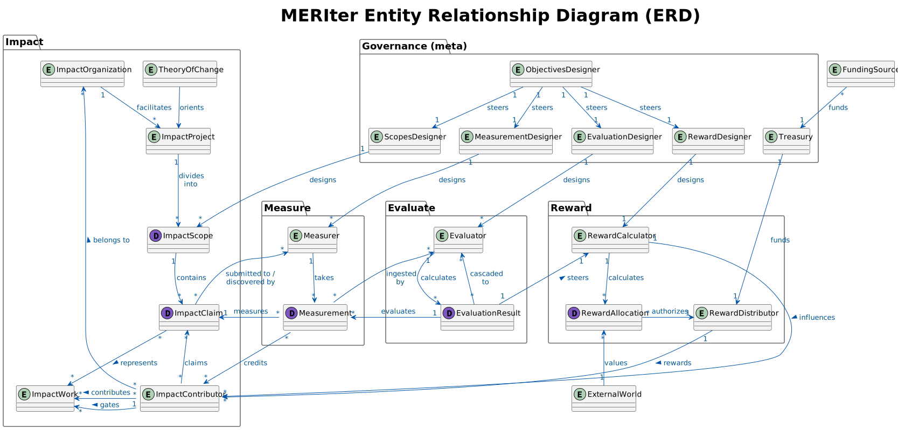

= Impact Evaluator Research

Research on Generalized Impact Evaluator systems, building on the https://research.protocol.ai/publications/generalized-impact-evaluators/[Protocol Labs research framework^].

== Overview

This research explores modular systems for coordinating work by measuring, evaluating, and retrospectively rewarding impact achieved towards specified valuable objectives.

Currently includes Entity Relationship Diagram modeling for core system architecture design.

=== Key Components

* **Governance**: ObjectivesDesigner, ScopesDesigner, MeasurementDesigner, EvaluationDesigner, Treasury
* **Impact Tracking**: ImpactOrganization → ImpactProject → ImpactScope → ImpactClaim + ImpactContributor
* **Measurement**: Measurer taking Measurements of ImpactClaims
* **Evaluation**: Evaluator performing Evaluations of Measurements
* **Rewards**: RewardCalculator → RewardAllocation → PayoutProcessor → ImpactContributor

== Current Research Phase

The research currently focuses on system architecture design and modeling.

=== Entity Relationship Diagram

The diagram shows the conceptual model for Impact Evaluator systems with entities grouped into logical packages:

* IE Governance
* Impact Tracking
* Measurement
* Evaluation
* Rewards

== Focus Areas

The research includes focused analysis of specific system components, as defined in the focus areas configuration.

[NOTE]
====
Additional research components and analysis will be added as the research develops.
====
